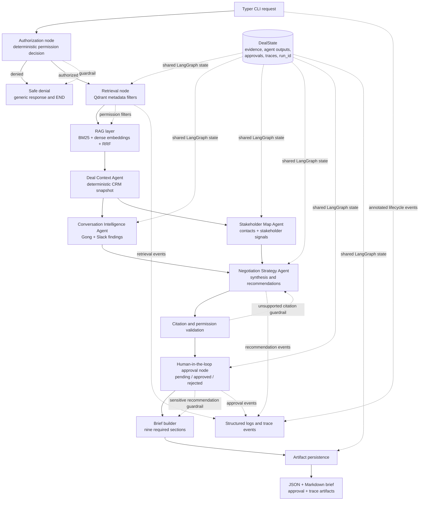
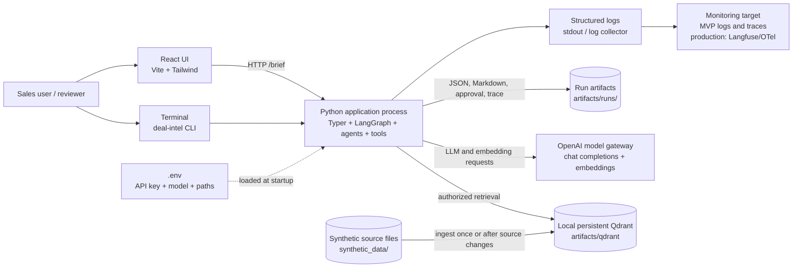

# Architecture Overview

## Logical view

The workflow is a LangGraph state machine. Authorization is the first gate, the two
evidence-driven specialist agents run in parallel, and the Negotiation Strategy Agent waits
for both specialist outputs.

### Logical responsibilities

- `authorize` decides access deterministically. An unauthorized request does not reach RAG or
  any agent.
- `retrieve` applies opportunity, source type, and access level filters before ranking.
- The RAG layer combines BM25 lexical ranking and dense semantic ranking with Reciprocal Rank
  Fusion (RRF).
- `Deal Context Agent` creates a deterministic canonical snapshot. The Conversation and
  Stakeholder agents run concurrently.
- `Negotiation Strategy Agent` synthesizes specialist outputs and policy evidence.
- Citation validation rejects evidence IDs outside the authorized evidence context.
- Approval routing marks pricing, legal, customer-facing, and low-confidence recommendations
  for human review.
- Every agent, retrieval, tool, approval, and recommendation event is written to the trace
  collector and persisted with the run.

## Deployment view

The MVP runs locally through the CLI or the FastAPI service, with the React UI as a thin
presentation layer. Qdrant runs in local persistent mode on disk; it is not a separate service.
The API reuses one local client and serializes requests because file-backed Qdrant storage does
not support multiple clients or processes opening the same folder concurrently. OpenAI is the
external model gateway for chat completions and embeddings.

### Deployment responsibilities

- `uv run deal-intel ingest` reads source files and rebuilds the persistent local Qdrant index.
- `brief` and `search` read the existing index; they do not index source files.
- `.env` holds local configuration and secrets. It is ignored by Git; `.env.example` documents
  the required variables.
- LLM and embedding calls use configured timeout and targeted transient-error retries.
- The MVP monitoring surface is structured logs and persisted `trace.json`. A production
  deployment would add centralized metrics, alerting, distributed tracing, secret management,
  high availability, and durable external storage.
- Real Salesforce, Gong, Slack, or CRM writes are outside the MVP. Any future write-capable tool
  must add an idempotency contract before production use.

### Production scaling boundary

The local file-backed Qdrant client is intentionally an MVP choice. It is suitable for one local
API process, but it must not be shared by multiple API workers, containers, or a CLI and API at
the same time. Production replaces it with a managed or clustered Qdrant deployment (or
OpenSearch), configured through a service URL. Each stateless API worker can then use its own
client connection while the database service coordinates concurrent access.

Other production boundaries are documented in [PRODUCTION_READINESS.md](PRODUCTION_READINESS.md),
including API authentication, durable approval state, asynchronous job execution, atomic index
replacement, artifact storage, secrets management, model budgets, and centralized observability.
