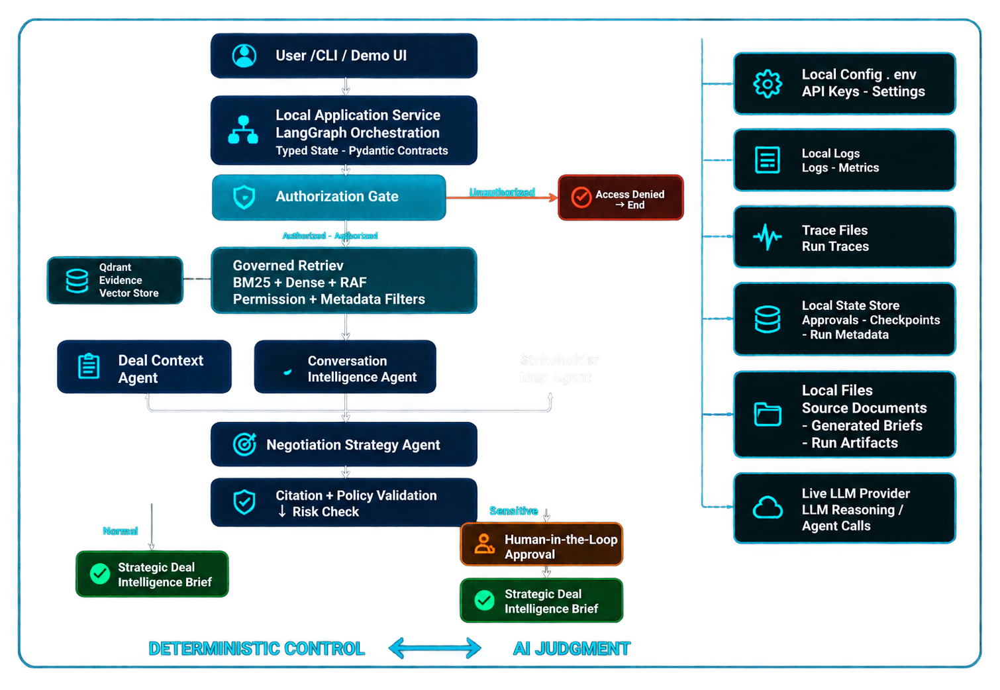
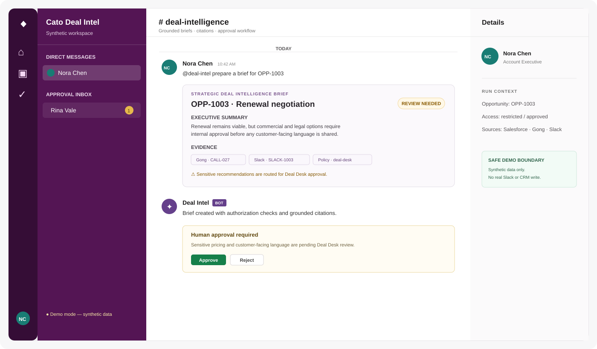

# Cato Strategic Deal Intelligence Assistant

An auditable, permission-aware multi-agent prototype for preparing strategic sales negotiation
briefs from fragmented GTM evidence.

The project combines Salesforce-style opportunity data, Gong call summaries, pricing notes,
Deal Desk policy, and synthetic Slack updates. It retrieves only evidence the requester is
allowed to see, asks specialized LLM-backed agents to analyze it, validates citations, and routes
sensitive recommendations through a human approval step.

> **Prototype boundary:** all business data is synthetic. The Slack experience is a local simulator;
> it does not send real Slack messages or update Salesforce. Production migration notes are in
> [`docs/PRODUCTION_READINESS.md`](docs/PRODUCTION_READINESS.md).

## What the system demonstrates

- Four-agent workflow: Deal Context, Conversation Intelligence, Stakeholder Map, and Negotiation Strategy.
- Authorization before retrieval and before generation.
- Hybrid BM25 + dense retrieval with metadata filters, recency weighting, and source reliability.
- Grounded recommendations with stable evidence IDs and citation validation.
- Human-in-the-loop approval for sensitive pricing, legal, and customer-facing recommendations.
- Structured traces for agents, tools, retrieval, approvals, and recommendations.
- CLI, FastAPI/Swagger, and a React Slack-style demo UI.
- Deterministic fake-LLM evaluation plus live-provider sample artifacts.

## Architecture



Detailed responsibilities and the production deployment view are in
[`docs/ARCHITECTURE.md`](docs/ARCHITECTURE.md).

## Requirements

- Python 3.13+
- [`uv`](https://docs.astral.sh/uv/)
- Node.js 18+ and npm for the web UI
- An OpenAI API key only for live LLM runs; the fake mode works offline

## Installation

```bash
git clone <repository-url>
cd cato_openai
uv sync
```

For live model calls:

```bash
cp .env.example .env
# Edit .env and set OPENAI_API_KEY.
```

The main configuration options are:

| Variable | Purpose | Example |
| --- | --- | --- |
| `OPENAI_API_KEY` | Live provider authentication | `sk-...` |
| `CATO_LLM_MODEL` | Default model | `gpt-4o-mini` |
| `CATO_LLM_SPECIALIST_MODEL` | Conversation/stakeholder model | `gpt-4o-mini` |
| `CATO_LLM_STRATEGY_MODEL` | Strategy model | `gpt-4o-mini` |
| `CATO_FAKE_LLM` | Use deterministic fake provider | `1` |
| `CATO_LLM_BUDGET_USD` | Per-period budget cap | `1.00` |
| `CATO_LLM_BUDGET_LEDGER_PATH` | Persistent usage ledger | `artifacts/llm_budget.json` |
| `CATO_LLM_MAX_RETRIES` | Bounded provider retries | `2` |
| `CATO_LLM_TIMEOUT_SECONDS` | Provider timeout | `30` |
| `CATO_QDRANT_PATH` | Local Qdrant storage | `artifacts/qdrant` |
| `CATO_OBSERVABILITY` | Enable structured traces/logs | `true` |
| `CATO_OBSERVABILITY_IO` | `metadata` or local-only `full` I/O logging | `metadata` |

Never commit `.env`, API keys, or unredacted production data.

## Quick start: deterministic local demo

This path uses no provider calls and no API key:

```bash
CATO_FAKE_LLM=1 uv run deal-intel demo
```

The command ingests the supplied synthetic evidence, runs an authorized example, and writes
inspectable artifacts under `artifacts/runs/<run_id>/`.

## CLI

Show all commands:

```bash
uv run deal-intel --help
```

### Ingest evidence into local Qdrant

```bash
uv run deal-intel ingest
```

This loads Salesforce, Gong, pricing, policy, permissions, and generated Slack updates into the
local collection. Ingestion is safe to repeat for the local demo; it rebuilds the local collection.

### Generate a brief

```bash
# Live provider
uv run deal-intel brief --opportunity OPP-1001 --user USR-5001

# Restricted opportunity with approval pending
uv run deal-intel brief --opportunity OPP-1003 --user USR-5003 --approval pending

# Interactive approval prompt
uv run deal-intel brief --opportunity OPP-1003 --user USR-5003 --approval ask

# Deterministic offline version
CATO_FAKE_LLM=1 uv run deal-intel brief --opportunity OPP-1001 --user USR-5001 --approval pending
```

Valid `--approval` values are `ask`, `approved`, `rejected`, and `pending`.

### Search authorized evidence

```bash
uv run deal-intel search \
  --opportunity OPP-1001 \
  --user USR-5001 \
  --query "renewal risk pricing stakeholders"
```

The search tool applies the requester’s authorization filters before ranking evidence.

### Evaluate the golden set

```bash
# Default: deterministic fake provider, all scenarios
uv run deal-intel evaluate

# Explicit deterministic run
CATO_FAKE_LLM=1 uv run deal-intel evaluate --mode fake --suite all

# Only workflow or quality scenarios
uv run deal-intel evaluate --mode fake --suite workflow
uv run deal-intel evaluate --mode fake --suite quality

# Live model, repeated three times
CATO_LLM_BUDGET_USD=2.00 uv run deal-intel evaluate --mode live --repeats 3 --suite all

# Run fake first, then live
uv run deal-intel evaluate --mode both --repeats 3 --suite all
```

The full golden set should normally use record/replay fixtures in CI. Use live runs for a small
smoke suite, release checks, or explicit re-recording after a model, prompt, schema, retrieval,
authorization, or safety change. See [`evals/README.md`](evals/README.md).

### Inspect usage

```bash
uv run deal-intel usage --run-id <run_id>
```

## API and Swagger

Start the FastAPI service:

```bash
# Deterministic local API
CATO_FAKE_LLM=1 uv run deal-intel-api

# Live API
uv run deal-intel-api
```

Open:

- Swagger UI: <http://127.0.0.1:8000/docs>
- OpenAPI JSON: <http://127.0.0.1:8000/openapi.json>
- Health: <http://127.0.0.1:8000/health>

### Main endpoints

| Method | Endpoint | Purpose |
| --- | --- | --- |
| `GET` | `/health` | Liveness check |
| `POST` | `/brief` | Generate an authorized brief or safe denial |
| `GET` | `/approvals/inbox?user_id=USR-5005` | Reviewer inbox |
| `GET` | `/approvals/inbox/count?user_id=USR-5005` | Pending approval count |
| `POST` | `/approvals/{run_id}/decision` | Approve or reject a pending run |
| `GET` | `/runs/requests?user_id=USR-5003` | Restore requester runs |
| `GET` | `/runs/{run_id}/usage` | Read persisted token/cost summary |

Example request:

```bash
curl -X POST http://127.0.0.1:8000/brief \
  -H 'content-type: application/json' \
  -d '{"opportunity_id":"OPP-1001","user_id":"USR-5001"}'
```

The API intentionally does not accept an approval decision on `/brief`. Approval is a separate,
role-protected operation. For `OPP-1003`, use `USR-5003` to demonstrate an authorized request and
`USR-5007` to demonstrate a safe unauthorized denial.

## Slack-style demo UI

The repository includes a local React/Vite simulator that looks and behaves like a Slack workflow.
It is not a real Slack connector. It demonstrates:

- Switching between synthetic demo identities.
- Requesting a deal brief from a conversation.
- Displaying evidence and citations.
- Showing `awaiting_approval` for sensitive recommendations.
- Switching to the Deal Desk reviewer and approving/rejecting the same persisted run.



Start the API in one terminal, then the UI in another:

```bash
# Terminal 1
CATO_FAKE_LLM=1 uv run deal-intel-api

# Terminal 2
cd frontend
npm install
npm run dev
```

Open <http://127.0.0.1:5173>.

Suggested walkthrough:

1. Select Nora Chen (`USR-5003`).
2. Request `OPP-1003`.
3. Observe the approval-required result.
4. Switch to Rina Vale (`USR-5005`).
5. Open the approval inbox and approve or reject the run.

The standalone static mockup is also available at
[`docs/slack-chat-mockup.html`](docs/slack-chat-mockup.html).

## Tests and verification

```bash
uv run pytest -q
uv run ruff check .
uv run mypy cato_deal_intel

cd frontend
npm run build
```

GitHub Actions runs the same verification on every push and pull request through
[`Test Verification`](.github/workflows/ci.yml): Ruff, Mypy, the complete fake-LLM test suite, a
full API E2E journey, and the frontend production build.

Run only the E2E journey locally:

```bash
CATO_FAKE_LLM=1 uv run pytest -q tests/e2e -m e2e
```

Current verification baseline:

- Python tests: **50 passed**
- Fake evaluation: **10/10 passed**
- Ruff: clean
- Mypy: clean
- Frontend production build: passing

Results and scenario definitions are documented in
[`docs/FINAL_RUN_RESULTS.md`](docs/FINAL_RUN_RESULTS.md) and [`evals/README.md`](evals/README.md).

## Artifacts and data

Each completed workflow is persisted under:

```text
artifacts/runs/<run_id>/
├── request.json
├── authorization.json
├── retrieved_evidence.json
├── agent_outputs.json
├── approval.json
├── brief.json
├── brief.md
└── trace.json
```

Synthetic source files live under [`synthetic_data/`](synthetic_data/). Curated sample runs are in
[`submission/`](submission/), including a real OpenAI-backed approved run and a deterministic
Slack-citation golden run.

## Production direction

The local prototype deliberately keeps the workflow easy to run and inspect. A production version
would add authenticated identity, live source connectors, queue-based ingestion, versioned index
updates, managed Qdrant, durable workflow/approval state, centralized observability, secret
management, rate limits, and asynchronous Slack handling.

For model cost and regression control, use versioned LLM record/replay fixtures for the large
golden set and retain a small live smoke suite. Production user requests should call the live model;
replay is an evaluation and incident-reproduction mechanism, not a user-facing response cache.

See:

- [`docs/ARCHITECTURE.md`](docs/ARCHITECTURE.md) — logical and deployment views.
- [`docs/PRODUCTION_READINESS.md`](docs/PRODUCTION_READINESS.md) — migration plan, caching, queues,
  idempotency, and record/replay strategy.
- [`docs/SECURITY_NOTES.md`](docs/SECURITY_NOTES.md) — authorization and prompt-injection boundaries.
- [`docs/requirements/Cato_GTM_AI_Engineer_Home_Task.md`](docs/requirements/Cato_GTM_AI_Engineer_Home_Task.md)
  — original assignment requirements.
