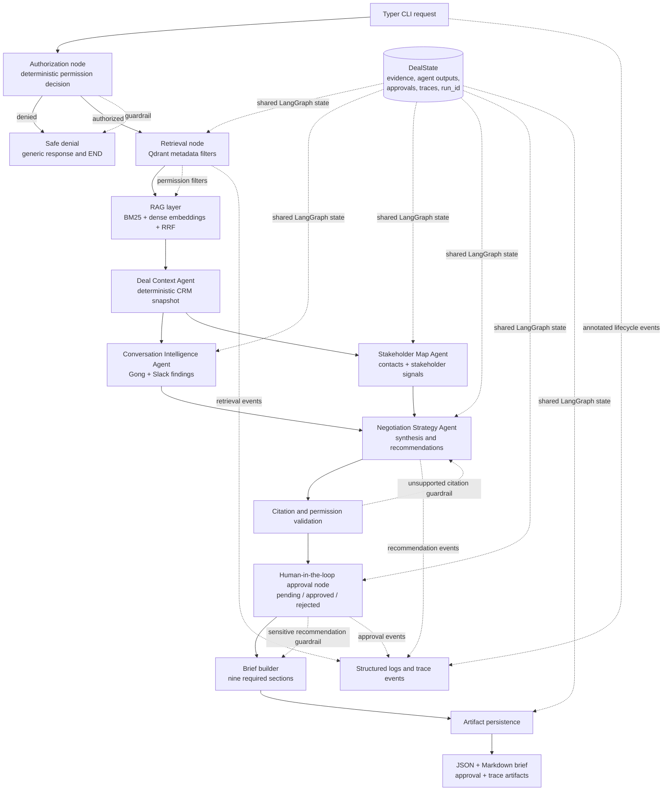
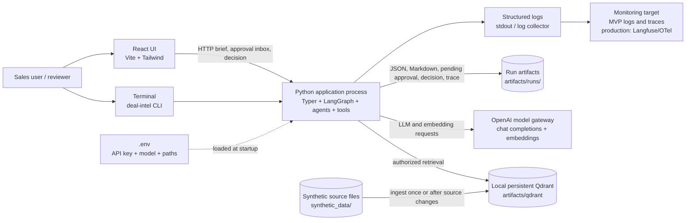

# Architecture Overview

## Python package layout

The package is organized around responsibilities. A request enters through an interface, the
orchestration layer runs the workflow, and focused components handle authorization, retrieval,
model calls, and persistence.

```text
cato_deal_intel/
├── agents/                 # Agent roles, prompts, and agent-facing tools
│   ├── core.py
│   ├── prompts.py
│   └── tools.py
├── api/app.py              # FastAPI routes; delegates to the shared workflow
├── cli/app.py              # Typer commands; delegates to the shared workflow
├── evaluation/runner.py    # Golden and quality evaluation harness
├── llm/                    # Providers, retries, settings, and token/cost accounting
│   ├── protocols.py
│   ├── providers.py
│   ├── fake_provider.py
│   ├── budget.py
│   ├── retry.py
│   └── settings.py
├── observability/tracing.py # Structured logs and run traces
├── orchestration/          # LangGraph, workflow entry point, and application services
│   ├── graph.py
│   ├── services.py
│   └── workflow.py
├── retrieval/              # Source loading, embeddings, and hybrid evidence retrieval
│   ├── sources/
│   │   ├── data.py
│   │   ├── reader.py
│   │   └── internal/       # Source-specific evidence loaders
│   ├── embeddings.py
│   └── index.py
├── security/               # Deterministic access control and citation validation
│   ├── authorization.py
│   └── validation.py
├── repositories/            # Application-facing data access contracts
│   └── contracts.py       # deal, evidence, and approval repository protocols
├── storage/                 # Run artifacts, Qdrant client factory, and shared paths
│   ├── artifact_store.py
│   ├── client_factory.py
│   ├── approval_store.py   # Local persisted reviewer inbox and decisions
│   └── paths.py
└── models.py                # Shared typed contracts exchanged between layers
```

`models.py` contains shared data contracts, not workflow logic. `storage/paths.py` is the single
source for the local source-data, run-artifact, and Qdrant paths. The CLI and API remain thin
adapters and both call `orchestration/workflow.py`; neither owns a separate business flow.

The normal direction of work is:

```text
CLI / API → orchestration → agents and services → security / retrieval / LLM → storage
```

The shared contracts and observability helpers are used across these layers. Agent tools call
application services, while orchestration wires the tools into the graph. This keeps permission
decisions in code and prevents the LLM from choosing its own data-access filters.

### Workflow graph lifecycle

The LangGraph structure is compiled once when `orchestration/workflow.py` is imported and reused
for later requests. Compilation builds the static nodes and edges; it does not contain request
data. Each call to `create_brief` still creates a fresh `DealState` with a new `run_id`, trace
collector, requester, opportunity, and injected dependencies. This keeps requests isolated while
avoiding repeated graph construction on the request path. The same lifecycle principle is used
for application-scoped read-only dependencies such as the static `SourceData` snapshot and the
shared local Qdrant client.

## Source data lifecycle and cache semantics

`SourceData` owns the typed local source snapshot used for authorization and deterministic deal
lookups. Its `cached_property` values are instance-local: the first lookup builds the records or
dictionary index, and later lookups on the same object reuse the in-memory result.

For one brief workflow, the application creates one `SourceData` instance and places it in the
shared graph state. The authorization, retrieval, conversation, stakeholder, and strategy nodes
therefore reuse the same parsed records and indexes. The evidence text itself is not loaded from
the source files during every brief request; it is retrieved from the already-built Qdrant index.

The local API now keeps one application-scoped `SourceData` instance and passes it into each brief
workflow. The opportunity and permission files are therefore parsed and indexed once per API
process, then reused by later requests and approval endpoints. Direct CLI workflows and tests can
still provide their own instance, which keeps those entry points isolated.

If source files become live or mutable, the shared instance must gain an explicit
refresh/invalidation policy (for example a reload after ingestion, a file-version check, or a
TTL). A global cache without invalidation must not be used for production permissions because it
could return stale authorization data.

## Synchronous requests and asynchronous ingestion

The MVP does not implement live connectors or a queue. If the system moves to production, source
ingestion should be asynchronous: connectors publish changes to a queue and workers update the
source snapshot, archive, and vector index. User-facing requests remain a separate concern and do
not have to become asynchronous just because ingestion is asynchronous.

For a Slack interaction, the request handler should acknowledge immediately, enqueue the work,
and return a short status such as `Preparing the deal brief…`. Slack requires the acknowledgement
within three seconds; the worker then posts the completed result through the interaction's
`response_url` or the Slack Web API. This gives the user an immediate response while allowing the
expensive retrieval and LLM workflow to run asynchronously. The same pattern can expose a `job_id`
and status endpoint for the HTTP API.

## Logical view

The workflow is a LangGraph state machine. Authorization is the first gate, the two
evidence-driven specialist agents run in parallel, and the Negotiation Strategy Agent waits
for both specialist outputs.



### Logical responsibilities

- `authorize` decides access deterministically. An unauthorized request does not reach RAG or
  any agent.
- `retrieve` applies opportunity, source type, and access level filters before ranking.
- The RAG layer combines BM25 lexical ranking and dense semantic ranking with Reciprocal Rank
  Fusion (RRF).
- `Deal Context Agent` creates a deterministic canonical snapshot. The Conversation and
  Stakeholder agents run concurrently.
- `Negotiation Strategy Agent` synthesizes specialist outputs and policy evidence.
- Citation validation rejects evidence IDs outside the authorized evidence context.
- Approval routing marks pricing, legal, customer-facing, and low-confidence recommendations
  for human review.
- Every agent, retrieval, tool, approval, and recommendation event is written to the trace
  collector and persisted with the run.
- API runs that need human review finish agent generation in an explicit `awaiting_approval`
  lifecycle state. The API persists a reviewer assignment next to the original run; only a user
  whose configured role is `Deal Desk Approver`, who is not the requester and is authorized for
  that opportunity, appears in the inbox. A separate decision endpoint updates that run's brief,
  approval records, Markdown artifact, and trace without calling the agents again. The requester
  does not receive the assigned reviewer identity.
- The React app polls the local approval inbox, shows the pending count beside Rina Vale in
  Direct Messages, and presents the full brief and evidence in her review conversation. The
  requester can see the latest decision for runs initiated in the current UI session. A fresh UI
  load starts with a clean local conversation while persisted runs remain in artifacts. This is a
  UI simulation—not a Slack integration or external message.

### Agent contracts and failure behavior

| Component | Inputs and output | Tools | Failure and validation behavior |
| --- | --- | --- | --- |
| Deal Context Agent | Authorized opportunity and CRM evidence → typed `DealSnapshot` | `get_opportunity_snapshot` | Missing or malformed opportunity data fails the graph before synthesis; model output is not used for canonical CRM fields. |
| Conversation Intelligence Agent | Authorized Gong and Slack evidence → typed findings and missing information | `search_authorized_evidence` | Provider timeout, schema failure, or citation outside the authorized evidence set fails the node and is traced. |
| Stakeholder Map Agent | Authorized contacts, calls, and account-team notes → typed stakeholder findings | `search_authorized_evidence` | Provider timeout, schema failure, or citation outside the authorized evidence set fails the node and is traced. |
| Negotiation Strategy Agent | Deal snapshot, specialist outputs, policy evidence → typed actions and warnings | Deal Desk policy, approval request, recommendation validation | Invalid output or unsupported citations fail validation; sensitive actions are marked for human review. |

The two LLM specialists run in parallel. If either fails, the MVP fails the overall run rather than
silently drafting a partial brief; the failure trace and run artifacts are persisted for diagnosis.
The caller can retry after the cause is resolved. Production should add bounded retry policy per
failure class and a durable, explicit partial-result policy before enabling degraded responses.

## Deployment view

The MVP runs locally through the CLI or the FastAPI service, with the React UI as a thin
presentation layer. Approval requests and decisions are stored in the local run-artifact folder;
this is suitable for the single-process demo, not a multi-worker production approval queue.
Qdrant runs in local persistent mode on disk; it is not a separate service.
The API reuses one local client and serializes requests because file-backed Qdrant storage does
not support multiple clients or processes opening the same folder concurrently. OpenAI is the
external model gateway for chat completions and embeddings.



### Deployment responsibilities

- `uv run deal-intel ingest` reads source files and rebuilds the persistent local Qdrant index.
- `brief` and `search` read the existing index; they do not index source files.
- `.env` holds local configuration and secrets. It is ignored by Git; `.env.example` documents
  the required variables.
- LLM and embedding calls use configured timeout and targeted transient-error retries.
- The MVP monitoring surface is structured logs and persisted `trace.json`. A production
  deployment would add centralized metrics, alerting, distributed tracing, secret management,
  high availability, and durable external storage.
- Real Salesforce, Gong, Slack, or CRM writes are outside the MVP. Any future write-capable tool
  must add an idempotency contract before production use.

### Production scaling boundary

The local file-backed Qdrant client is intentionally an MVP choice. It is suitable for one local
API process, but it must not be shared by multiple API workers, containers, or a CLI and API at
the same time. Production replaces it with a managed or clustered Qdrant deployment (or
OpenSearch), configured through a service URL. Each stateless API worker can then use its own
client connection while the database service coordinates concurrent access.

Other production boundaries are documented in [PRODUCTION_READINESS.md](PRODUCTION_READINESS.md),
including API authentication, durable approval state, asynchronous job execution, atomic index
replacement, artifact storage, secrets management, model budgets, and centralized observability.
